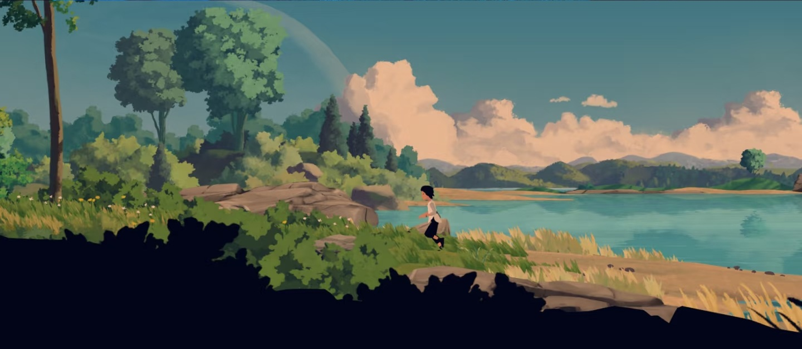
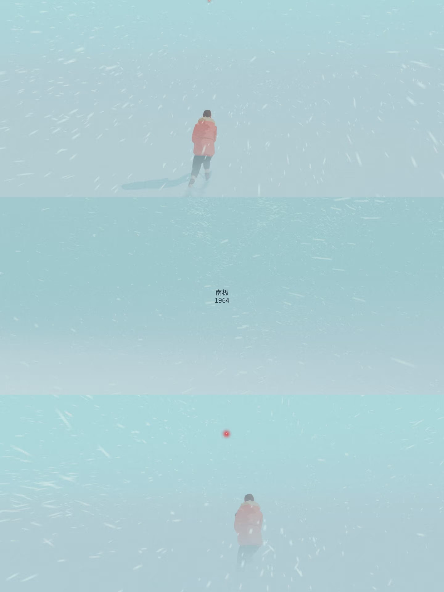
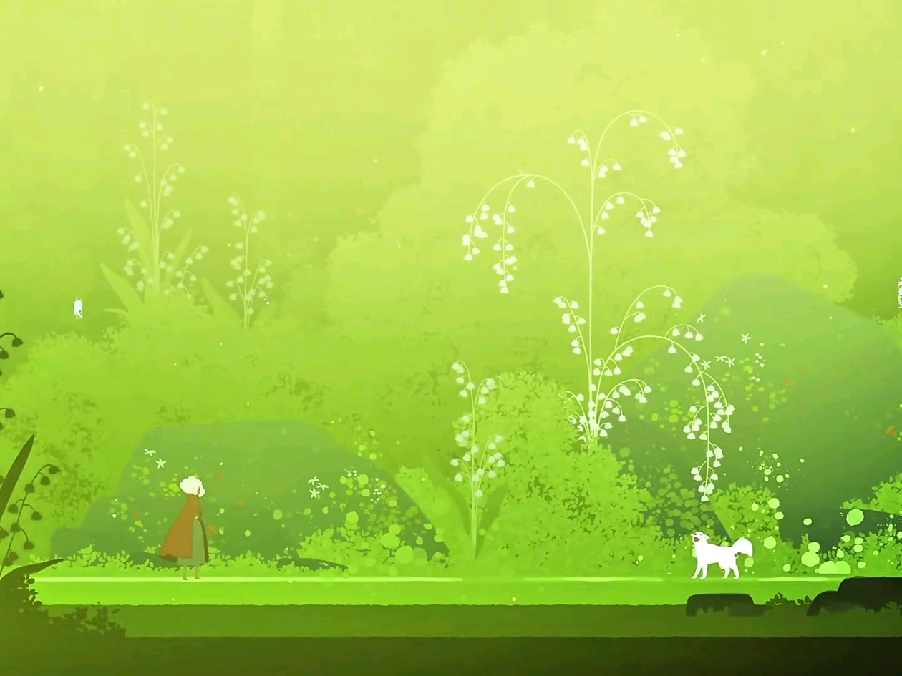
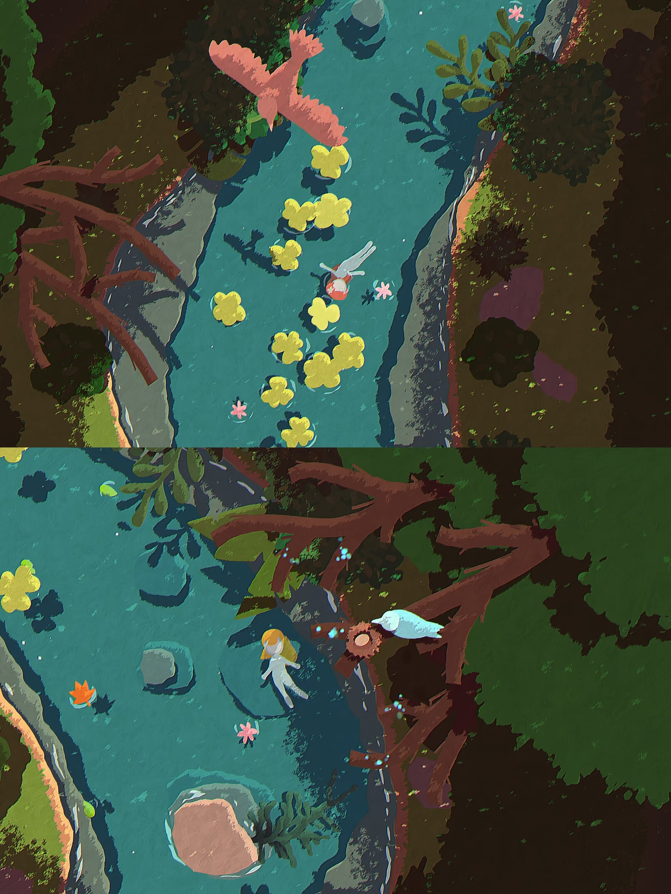
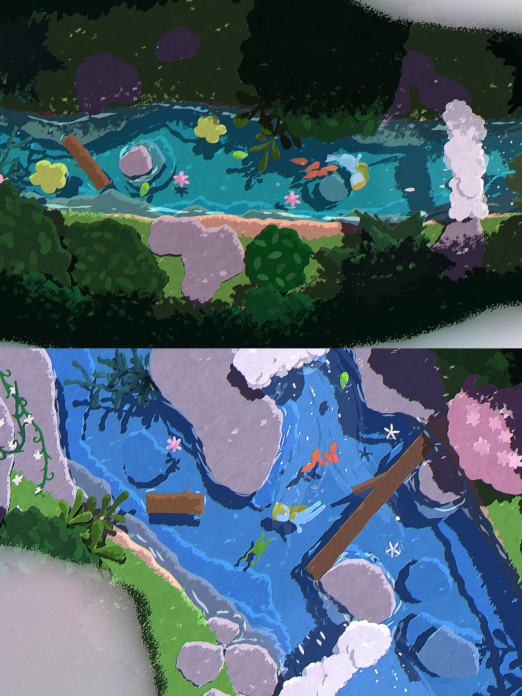
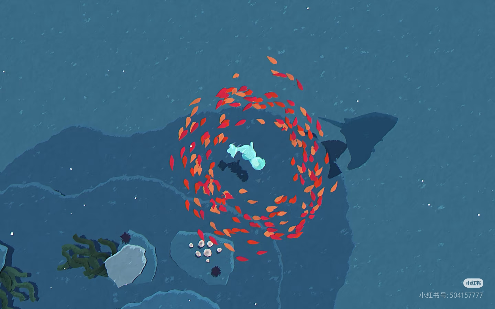

# 《归途》美术风格设定 v1.0

## 1. 风格定位

《归途》的美术基调应偏向**治愈、自然、轻叙事、手绘感、低压力但有旅途孤独感**。

关键词：

- 手绘绘本感
- 温柔自然
- 轻水彩 / 厚涂结合
- 柔和光雾
- 大面积色块
- 清晰剪影
- 安静但不空
- 迁徙、归家、风、雨、夜航

游戏虽然有饥饿、陷阱、天敌和失败系统，但视觉上不应做成恐怖或压迫风。危险可以存在，但要以**自然警示、剪影、颜色变化、风雨气氛**来表达，而不是血腥、尖锐、强刺激。

## 2. 参考图

### 2.1 横版湖畔与远景层次



适合参考：

- 横版构图
- 湖面、远山、云层、树丛的分层
- 前景深色剪影与中远景柔和色块的对比
- 温暖、舒缓、有旅行感的自然氛围

用于《归途》：

- 主背景的大结构
- 草原 + 森林 + 湖泊的横向卷轴场景
- 低空前景深色草丛、树枝剪影
- 远处山丘、云、湖面的柔和层次

### 2.2 雪雾极简氛围



适合参考：

- 大面积低饱和色块
- 极简 UI / 字幕风格
- 风雪粒子营造空间感
- 孤独、安静、微冷的氛围

用于《归途》：

- 暴雨、雾气、夜航时的能见度处理
- 画面中“风”的可视化
- 暴风雨阶段的低对比度遮罩
- 结算或章节过渡的安静文字风格

不要直接照搬：

- 过高的画面留白不适合常规飞行关卡，因为玩家需要看清食物和障碍。

### 2.3 发光森林与明亮治愈感



适合参考：

- 高亮绿色森林氛围
- 白色小花、发光植物、细线条植物的梦幻感
- 角色与环境的童话比例
- 明亮但柔和的治愈气质

用于《归途》：

- 白色花草、蒲公英、飞虫光点
- 灌木浆果和草地食物的表现
- 夜航暖光区域的“安全感”
- 雨后清晨、黎明阶段的色彩恢复

注意：

- 绿色不能过亮到影响可读性。食物、陷阱、天敌轨迹必须从背景里跳出来。

### 2.4 俯视溪流与装饰性自然图案



适合参考：

- 扁平色块与手绘笔触结合
- 水流、石块、树枝、花叶的图案化设计
- 强烈的自然装饰感
- 暗部边缘形成画面框景

用于《归途》：

- 湖泊段的水面纹理
- 俯视参考可转译为侧视中的水波、浮叶、岸边植物
- 装饰性树枝、叶片、花朵
- 天敌或风场经过时水面/草叶的动势设计

注意：

- 《归途》是侧视横版，不切换成俯视玩法。该参考主要用于纹理语言和自然图案，不用于镜头角度。

### 2.5 溪流近景与高对比自然边框



适合参考：

- 深色树冠边框
- 蓝色水面与粉紫石块的柔和对比
- 白色水花、泡沫、花朵作为视觉点缀
- 局部高饱和色用于引导注意力

用于《归途》：

- 湖泊段
- 前景树冠/树枝遮挡
- 水面高光和泡沫
- 可交互物的色彩提示

注意：

- 深色边框不要遮挡小鸟和关键交互物。

### 2.6 蓝色夜景与叶片旋涡



适合参考：

- 深蓝夜色
- 叶片旋涡形成视觉中心
- 红橙色叶片在蓝色背景中的强识别度
- 梦境般的漂浮感

用于《归途》：

- 夜航阶段
- 风向、气流、顺风带的可视化
- 暖光飞虫与冷光诱导的颜色区分
- 游戏结束或特殊事件的诗意画面

## 3. 总体视觉原则

### 3.1 画面气质

画面应有自然旅途感，避免过度游戏化的硬边 UI 和强烈霓虹色。

推荐表达：

- 柔和自然光
- 圆润色块
- 微颗粒笔触
- 温暖云层
- 草叶和花朵轻微摆动
- 水面有手绘波纹
- 夜晚偏蓝但保留温柔光点

避免表达：

- 赛博霓虹
- 写实照片拼贴
- 高锐度金属质感
- 血腥攻击反馈
- 过多黑红警告元素
- 过度饱和的 UI 色块

### 3.2 画面清晰度

治愈风不等于模糊。游戏中必须保证可读性。

优先级：

1. 小鸟位置清楚。
2. 食物和危险可区分。
3. 高度层可通过背景和 UI 理解。
4. 天气和夜航影响氛围，但不能完全遮蔽玩法信息。

## 4. 色彩设定

### 4.1 主色调

| 类型 | 推荐色感 | 用途 |
| --- | --- | --- |
| 天空 | 柔和蓝绿、浅青、暖蓝 | 白天主背景 |
| 草地 | 黄绿、嫩绿、橄榄绿 | 草原、灌木、树叶 |
| 森林暗部 | 深绿、墨绿、蓝黑绿 | 前景剪影、树冠边缘 |
| 湖水 | 青蓝、蓝绿、浅湖蓝 | 湖泊段、水面 |
| 云层 | 暖白、桃粉、淡橙 | 白天云、黄昏 |
| 夜色 | 深蓝、蓝紫、低饱和青 | 夜航 |
| 暖光 | 柔黄、淡橙 | 安全光源、飞虫 |
| 危险提示 | 克制红、暗橙 | 天敌轨迹、受伤反馈 |

### 4.2 色彩比例

建议画面色彩比例：

- 60%：自然背景色，如天空、草地、湖水
- 25%：中景和前景色，如树冠、灌木、岩石
- 10%：光雾、云、花、水面高光
- 5%：交互提示色，如食物、危险轨迹、UI 重点

危险色不要铺满屏幕，只在关键时刻使用。这样既保持治愈感，也能让危险提示更醒目。

## 5. 笔触与造型语言

### 5.1 笔触

推荐：

- 手绘块面
- 轻微干刷纹理
- 边缘有自然抖动
- 水面和草地可带少量短线笔触
- 云和雾用柔边色团

不推荐：

- 完全矢量硬边
- 过度细碎写实纹理
- 像素风
- 3D 写实贴图

### 5.2 造型

推荐：

- 树冠是大色团叠加小色块。
- 草丛以整体轮廓为主，少量叶片点缀。
- 花、浆果、飞虫作为小而亮的视觉点。
- 岩石可以偏粉紫、灰蓝，增强柔和感。
- 水面使用流动曲线和短笔触表现。

## 6. 场景美术设定

### 6.1 白天主场景：草原 + 森林 + 湖泊

目标氛围：

- 温暖
- 轻松
- 有迁徙路途感
- 背景足够宽阔

画面结构：

- 远景：天空、云、远山、远处树线
- 中景：湖面、树丛、岩石、草坡
- 近景：深色草丛、树枝、灌木剪影
- 交互层：食物、障碍、陷阱、天敌、小鸟

参考重点：

- `ref_01_landscape_lake.png`
- `ref_03_glowing_forest.png`

### 6.2 低空区域

视觉内容：

- 草叶
- 灌木
- 地面昆虫
- 种子
- 诱饵
- 陷阱提示

色彩：

- 绿色为主
- 食物用红、黄、浅白点缀
- 陷阱使用棕色细枝、细绳，不能完全隐藏

### 6.3 中空区域

视觉内容：

- 树冠边缘
- 树上虫蛹
- 果实
- 柔和云层
- 背景树线

玩法作用：

- 作为安全路线和资源路线之间的过渡。
- 视觉上应最稳定、最容易阅读。

### 6.4 高空区域

视觉内容：

- 开阔天空
- 稀疏云层
- 远处鸟影
- 顺风气流
- 夜航暖光

色彩：

- 白天偏青蓝
- 黄昏偏桃粉和暖橙
- 夜晚偏深蓝和暖黄点光

## 7. 角色美术设定

### 7.1 主角：小滨鹬

主角需要保持自然真实的鸟类特征，但画风上可以略微柔化。

设计要求：

- 体型小，适合横版长距离飞行画面。
- 轮廓清楚，翅膀姿态容易读。
- 羽毛可以保留水彩感和柔边。
- 颜色不要太接近背景，腹部暖橙可作为识别点。
- 动画节奏轻，不要像强动作游戏那样夸张。

需要的主要动画：

- 滑翔循环
- 上升
- 下降
- 加速拍翅
- 受伤
- 被困
- 坠落
- 倒地

### 7.2 天敌

天敌不需要写实恐怖，建议使用大型深色剪影。

视觉规则：

- 大约是小鸟的 `2x`。
- 颜色以深蓝、深灰、墨绿为主。
- 蓄力时配合克制红色轨迹线。
- 冲刺时可带残影，但不要过度霓虹。

## 8. 交互物美术设定

### 8.1 食物

食物必须比背景更清楚，且每种食物有固定识别方式。

| 食物 | 色彩 | 形状语言 |
| --- | --- | --- |
| 地面昆虫 | 深色身体 + 浅色高光 | 小跳动点 |
| 种子 | 米黄 / 浅褐 | 小颗粒堆 |
| 灌木浆果 | 红 / 粉红 | 圆点成簇 |
| 树冠虫蛹 | 淡黄 / 米白 | 悬挂椭圆 |
| 树上果实 | 暖红 / 橙 | 圆形或小梨形 |
| 暖光飞虫 | 柔黄 | 发光小点 |
| 冷白光 | 冷白 / 淡蓝 | 闪烁点 |

### 8.2 障碍物

障碍物需要“看起来可以碰撞”。

| 障碍 | 视觉要求 |
| --- | --- |
| 树木 | 树干和树冠边界清楚，碰撞区域与视觉轮廓接近 |
| 密实灌木 | 颜色更深、更厚重，没有明显通路 |
| 可穿透灌木 | 更稀疏，留出空隙，浆果可见 |
| 湖泊 | 低空地面交互物消失，水面有流动感 |

### 8.3 陷阱

陷阱不能完全不可见，否则会破坏治愈游戏的公平性。

视觉要求：

- 诱饵有吸引力。
- 旁边有细绳、斜枝、竹篮边缘等提示。
- 触发时使用快速但不惊吓的动画。
- 被困时网兜覆盖小鸟，画面轻微晃动。

## 9. 天气与时间美术设定

### 9.1 雨天

参考：

- `ref_02_snow_minimal.png` 的低对比和粒子空间感。

表现：

- 雨前：灰云阴影从右向左扫过。
- 毛毛雨：少量细雨线。
- 大雨：雨线变密，远景变灰。
- 暴雨：加入雾气遮罩，食物降低饱和度但仍可辨。

### 9.2 夜航

参考：

- `ref_06_blue_leaf_swirl.jpg`

表现：

- 背景转为深蓝。
- 远景变成柔和剪影。
- 普通食物隐藏。
- 暖黄光作为安全路线。
- 冷白光作为诱导风险。
- 可以加入少量漂浮叶片或微光，暗示风和迁徙方向。

### 9.3 黄昏与黎明

表现：

- 黄昏：天空从青蓝转为桃粉、淡橙和蓝紫。
- 黎明：深蓝逐渐淡化，暖光回到草地和云层。
- 过渡应柔和，不要突然切换。

## 10. UI 风格

UI 要轻量、自然、克制。

推荐：

- 半透明柔色面板
- 细线条图标
- 圆润但不过度可爱的形状
- 米白、浅黄、浅青作为 UI 基础色
- 重要危险提示用低饱和红橙

避免：

- 大面积黑色面板
- 高亮霓虹按钮
- 厚重金属边框
- 过多数字和表格占据画面

核心 UI：

- 饱食度条
- 高度计
- 距离计
- 湿度计
- 体重提示
- 风向提示
- 夜航倒计时

## 11. 动效与氛围

建议动效：

- 草叶轻摆
- 云缓慢移动
- 小鸟翅膀轻柔循环
- 食物轻微闪光或摆动
- 暖光飞虫小范围漂浮
- 雨线随风倾斜
- 顺风带用叶片或线条流动表示
- 逆风用反向漂浮粒子和小鸟受阻姿态表示

动效原则：

- 慢而有生命感。
- 危险动效短促但不过度刺激。
- 交互反馈清楚，不能只追求氛围。

## 12. AI 生成资产提示词方向

后续生成美术资产时，可以使用以下方向。

### 12.1 通用风格提示

```text
soft hand-painted 2D game art, healing nature atmosphere, painterly watercolor texture, gentle lighting, large readable shapes, cozy landscape, subtle brush strokes, warm clouds, lush grass, soft blue-green palette, side-scrolling game background, clean silhouette, no photorealism, no harsh neon
```

中文方向：

```text
治愈系手绘二维游戏美术，柔和水彩和厚涂质感，自然风景，温暖云层，青绿色草地和湖水，大色块，清晰剪影，轻微笔触纹理，横版卷轴背景，安静、温柔、有旅途感，不要写实照片，不要霓虹赛博风
```

### 12.2 白天背景提示

```text
wide 2D side-scrolling landscape, soft lake, grassland and forest, distant hills, warm clouds, painterly watercolor texture, foreground dark grass silhouettes, gentle blue-green sky, cozy healing game background
```

### 12.3 夜航背景提示

```text
soft hand-painted night flight scene, deep blue sky, gentle silhouettes of trees and hills, warm yellow guiding light, tiny glowing insects, calm migratory journey mood, painterly 2D game background
```

### 12.4 湖泊段提示

```text
hand-painted 2D game lake segment, blue-green water, soft ripples, floating leaves, rounded rocks, flowers near the bank, gentle painterly brush strokes, readable side-scrolling composition
```

### 12.5 灌木与食物提示

```text
small hand-painted game asset, berry bush, soft green leaves, red berries, clear readable silhouette, transparent background, cozy watercolor style, side-view 2D game object
```

### 12.6 避免项

```text
photorealistic, 3D render, pixel art, cyberpunk, horror, gore, sharp metallic UI, high contrast neon, overly detailed noisy texture, realistic photograph, hard vector icon style
```

## 13. 与当前玩法的结合原则

1. 所有资产必须服务玩法识别。
2. 背景可以柔和，交互物必须清楚。
3. 夜航和暴雨可以降低可见度，但不能让玩家完全无法判断。
4. 危险提示要克制但准确。
5. 小鸟不能被背景吞掉，腹部暖色和外轮廓要保留。
6. 横屏构图优先，不因参考图中的俯视画面改变游戏镜头。
7. 参考图中的“治愈感、手绘感、自然色块、柔和光雾”是核心，而不是照搬具体角色或场景。

